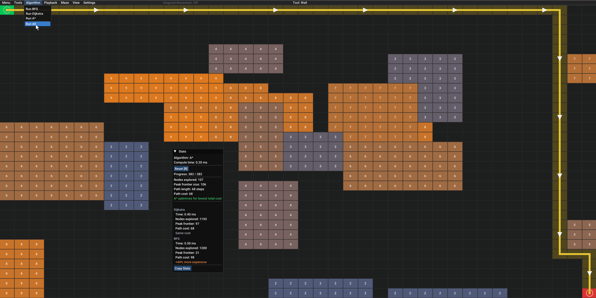
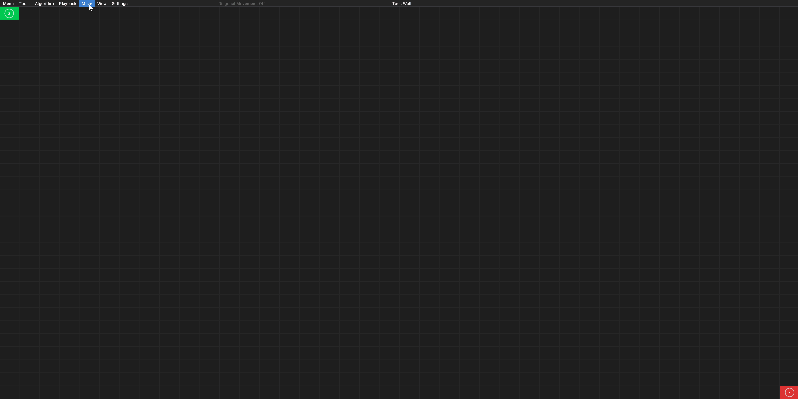
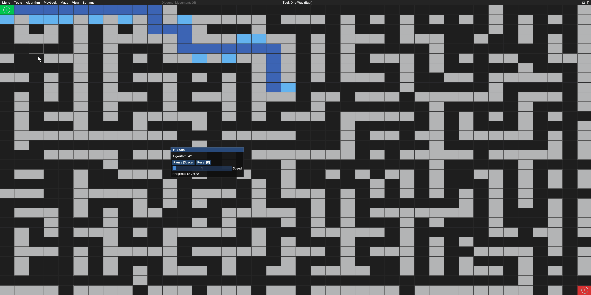
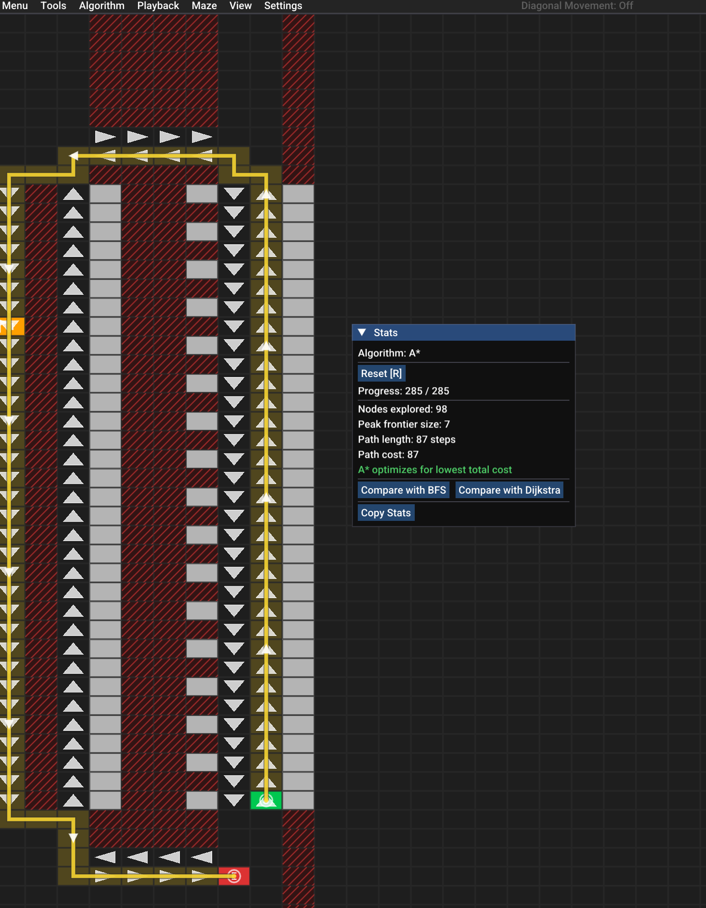

<p align="center">
  
  <br><br>
  <a href="https://github.com/rosenqvist/PathSim/actions/workflows/ci.yml"></a>
  <a href="https://github.com/rosenqvist/PathSim/releases"></a>
  <a href="LICENSE"></a>
  <a href="https://rosenqvist.github.io/PathSim/"></a>
</p>

PathSim is an interactive pathfinding visualizer built with C++ and Dear ImGui. Place walls, weighted terrain, waypoints, and one-way cells on a grid, then watch BFS, Dijkstra's, and A* solve it in real time and compare how each algorithm finds its way. The project is built with Clang and checked with clang-tidy, clang-format, and cppcheck.

Try it out: [rosenqvist.github.io/PathSim](https://rosenqvist.github.io/PathSim/)

##  Key Features

| Feature | Description |
|---------|-------------|
| **Three algorithms** | BFS, Dijkstra's, and A* with Run All to compare side by side |
| **Grid tools** | Walls, weighted cells (1–9), impassable cells, one-way cells, waypoints |
| **Diagonal movement** | 8-directional movement with corner-cutting prevention |
| **Maze generation** | Maze, Terrain, and Maze + Terrain modes that highlight algorithm differences |
| **Playback controls** | Step-by-step, pause, resume, adjustable speed |
| **Heatmap overlay** | Visualize exploration order from early (dark blue) to late (bright cyan) |
| **Stats panel** | Node count, frontier size, path cost, compute time, with copy button |
| **Keyboard shortcuts** | Full keyboard control for tools, playback, and weight/direction brushes |
| **Web build** | Runs in the browser via Emscripten and WebAssembly |
| **Resizable grid** | 5×5 up to 100×100 |

## Preview

### Algorithm comparison
Run all three algorithms on the same grid and compare performance in the stats panel.



### Maze generation
Generate mazes, weighted terrain, or both to create scenarios where the algorithms diverge.



### Heatmap overlay
See how each algorithm explores the grid, from early (dark blue) to late (bright cyan).



### Custom scenarios
Combine walls, impassable cells, one-way cells, waypoints, and weighted terrain to build complex grids.



## Why I Built This

At my part-time warehouse job I noticed that some picking routes were inefficient. Items that could be reached by a short direct path instead required the truck driver to loop back the way they came, turning what should be a natural progression through the aisles into unnecessary detours. I wanted to roughly compute how unoptimal these routes actually were, and to do that I needed a way to quickly mock up layouts and visualize different paths.

PathSim is that tool. It's built for drafting and experimentation, not production use. What started for me as way to sketch out warehouse routing turned into an exploration of how pathfinding algorithms work, why they make different choices, and how grid constraints like walls, weights, and one-way restrictions affect the paths they find.

## How It Works

All three algorithms solve the same problem, finding a path from start to end, but they make different tradeoffs.

**BFS** uses a simple queue and expands outward layer by layer. It guarantees the fewest hops but is completely blind to cell weights, so on a weighted grid it often picks an expensive route that a cost-aware algorithm would avoid.

**Dijkstra's** uses a priority queue ordered by accumulated cost. It always expands the cheapest frontier node next, guaranteeing the optimal cost path. The tradeoff is that it explores in all directions equally, visiting many nodes that aren't toward the goal.

**A*** builds on Dijkstra's by adding a heuristic (Manhattan distance for cardinal movement, octile distance for diagonal) that estimates remaining cost to the goal. This biases expansion toward the goal, so it typically visits far fewer nodes while still guaranteeing optimal cost.

The three maze generation modes are designed to highlight these differences. Pure mazes show A*'s heuristic advantage. Pure terrain shows how Dijkstra's and A* avoid expensive cells while BFS plows straight through. Combined mode makes all three algorithms pick different paths.

## Technical Decisions

**Core/UI split.** All algorithm and grid logic lives in a static library (`pathsim_core`) that has zero dependency on ImGui or any graphics code. The UI layer links against it but never leaks into it. This means the entire core can be tested with Catch2 in a headless CI environment without needing a window or GPU. It also made the Emscripten port straightforward since only the UI layer needed platform-specific changes.

**Flat vectors over 2D arrays.** The grid stores cells, walls, weights and directions in flat `std::vector`s indexed by `y * width + x`. A 2D vector-of-vectors would mean one heap allocation per row and scattered memory. Flat storage is one contiguous block which is better for cache locality when the algorithms iterate over neighbors. The tradeoff is manual index math but I centralized that in `index_at()` which also catches out-of-bounds access through debug asserts.

**`uint8_t` instead of `bool` for flat vectors.** `std::vector<bool>` is a special case in C++ where it packs bits and returns proxy objects instead of real references. This breaks `std::ranges` algorithms that expect normal iterators. `std::vector<uint8_t>` just behaves like a regular vector while still being compact enough.

**Separate wall bitfield.** `is_wall()` checks a dedicated `uint8_t` vector instead of comparing against `CellState::Wall`. This keeps the wall check fast during pathfinding while letting the `cells_` vector handle visual state independently. A cell can be showing as "Visited" while still being queryable as a wall without the two concerns interfering with each other.

**Stack-allocated neighbors.** A cell has at most 8 neighbors. Returning a `std::vector<Vec2i>` would heap-allocate on every single neighbor lookup and that function gets called for every node the algorithm visits. `Neighbors` uses a `std::array<Vec2i, 8>` with a count and custom `begin()`/`end()` iterators so it still works in range-for loops. Zero heap allocation in the hot path.

**Three maze modes.** The three generation modes exist specifically to make the algorithms behave differently. On a pure maze with walls only and uniform weight, BFS and Dijkstra find the same path so A*'s heuristic is the only differentiator. On pure terrain with weights only and no walls, BFS is the odd one out because it ignores cost entirely. Combined mode is where all three diverge which makes the comparison actually interesting.

**vcpkg for desktop, FetchContent for web.** The desktop build uses vcpkg because it handles ImGui, GLFW and Catch2 reliably across platforms. The Emscripten build can't use vcpkg so it fetches ImGui with CMake's FetchContent and uses Emscripten's built-in GLFW port. This keeps the web build self-contained without maintaining a separate dependency system.

**Dual-compiler CI.** The CI matrix runs both Clang and GCC. Each compiler has its own warnings and edge cases so passing both with `-Werror` catches more bugs than either one alone. clang-tidy runs only on the Clang build since it needs Clang's AST and clang-format gets its own job to keep formatting failures separate from build failures.

## What I'd Do Differently

If I started over I'd separate core logic from UI on day one instead of refactoring it in later. The Emscripten port would have been much simpler with that boundary already in place. I'd also plan for cross-platform builds earlier since adapting the main loop for Emscripten meant rewriting it entirely to work with the browser's frame callback. 

## Building

### Prerequisites

- C++20 compiler (Clang, GCC, or MSVC)
- CMake 3.25+
- Ninja
- [vcpkg](https://github.com/microsoft/vcpkg) with `VCPKG_ROOT` environment variable set

vcpkg handles all dependencies (Dear ImGui, GLFW, Catch2) automatically.

### Desktop
```bash
git clone https://github.com/rosenqvist/PathSim.git
cd PathSim

cmake --preset release
cmake --build build/release
./build/release/PathSim
```

### Tests are built with: [Catch2](https://github.com/catchorg/Catch2)
```bash
cmake --preset debug
cmake --build build/debug
ctest --test-dir build/debug --output-on-failure
```

### Web (Emscripten)

Requires [Emscripten](https://emscripten.org/docs/getting_started/downloads.html) installed. vcpkg is not needed for the web build.
```bash
emcmake cmake -B build/web -DCMAKE_BUILD_TYPE=Release
cmake --build build/web
```

Output is in `build/web/web/`. Open `PathSim.html` in a browser.

## License

[MIT](LICENSE)
